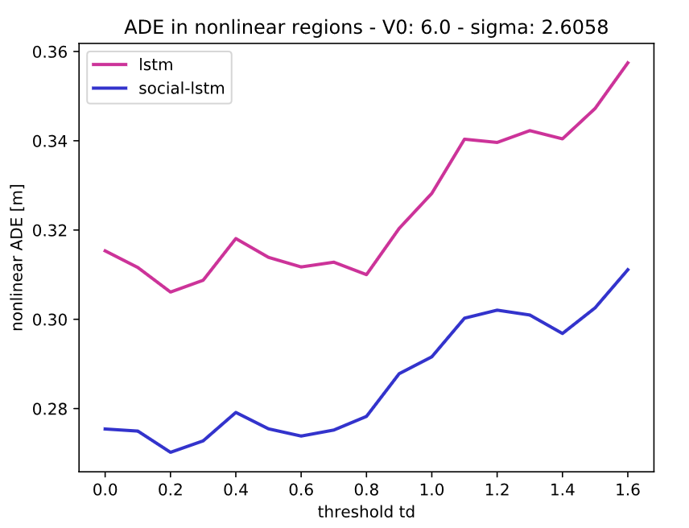
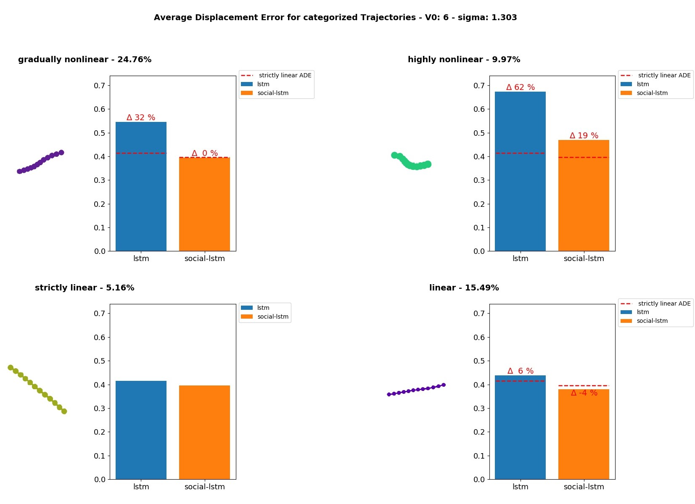
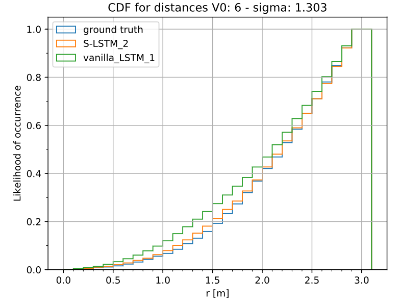

# Experiments

The scripts in this folder allow you to conduct several experiments on your trajectory prediction models. 

## Train and Evaluate New Models

You can train and evaluate your models on real and synthetic datasets.

### Step 1: Prepare your Data

#### Real Datasets 

 You will find five sets of data of real-world human motion behavior from the UCY [[2]](#1) and ETH [[3]](#2) datasets in the folder [datasets](datasets). For these datasets, we use the leave-one-out approach, i.e. we train on 4 sets and test on the remaining set.

#### Synthetic Datasets 

In order to generate synthetic datasets that focus exclusively on the interactions between pedestrians, follow the instructions [here](../Generate_Datasets). The respective datasets will be saved in the folder [datasets](datasets). Before training your model, make sure that the respective set exists in the folder. 

### Step 2: Train a Model

You can train a new model by running the script `main/Experiment_Control.py`. This script has a number of command-line flags that you can use in order to configure the training process. A detailed explanation of these flags can be found [here](./ARGUMENTS.md).

#### Real Datasets

To train a new model on datasets of real-world human motion behavior you have to set the flag `--dataset_type` to `real`. Furthermore, you need to specify the name of the dataset you want to train and evaluate your model on. For example, to train a model on the ZARA1 dataset run the script:

```
python main/Experiment_Control.py --dataset_type real --dataset_name zara1
```

By default, this will train the Vanilla LSTM model on the respective dataset. The trained model will be saved under <code>Saved_Models/*datasetname*/*modelname*</code>. You can specify the model type (Vanilla LSTM model or Social LSTM model [[1]](#3)) using the command-line flag `--model_type`. 

#### Synethetic Datasets 

To train a new model on a synthetic dataset that was created using the scripts in [this](../Generate_Datasets) folder, you have to set the flag `--socialforce` to `True`. In addition, you need to define the flag `--dataset_type` as `square` or `rectangle` according to the dataset generated. Finally, you need to specify the values of `V0` and `sigma`. For example, to train a model on a synthetic dataset that was generated with values `V0 = 4` and `sigma = 1.303` run the following script: 

```
python main/Experiment_Control.py --socialforce True --dataset_type square --V0 4 --sigma 1.303
```

By default, this will train the Vanilla LSTM model on the synthetic dataset squaresimulated_V04b1u303. The trained model will be saved under <code>Saved_Models/*datasetname*/*modelname*</code>. You can specify the model type using the command-line flag `model_type`.

### Step 3: Evaluate a Model
 
 You can evaluate your trained models by setting the command-line flag `--phase` to `test`. In this manner, you can evaluate the above trained models as follows: 

#### Real Datasets

```
python main/Experiment_Control.py --dataset_type real --dataset_name zara1 --phase test
```

#### Synthetic Datasets

```
python main/Experiment_Control.py --socialforce True --dataset_type square --V0 4 --sigma 1.303 --phase test 
```

## Evaluation Metrics 

In order to analyze the ability of a model to predict social interactions between pedestrians, we define evaluation metrics that focus on the social interactions between pedestrians.

### Overall Average and Final Displacement Error 

 | 
:-------------------------:|:-------------------------:
ADE of Vanilla LSTM Model for various synthetic datasets | ADE of Social LSTM Model for various synthetic datasets

As described in [chapter 5](../Bachelor_Thesis_Philipp_Mondorf.pdf), we train and evaluate our models on various synthetic datasets that are differently influenced by social interactions between pedestrians. These datasets are characterized by the corresponding values of `V0` and `sigma`. Whenever you evaluate your model on a synthetic dataset, the Average Displacement Error (ADE) and Final Displacement Error (FDE) of the model is recorded in the file <code>Analyse_Results/Overall_Loss/socialforce_*modelname*_results.xlsx</code>. 

In order to create a heatmap similar to the ones you can find above, follow these steps: 

1. Train and evaluate your models on the desired datasets

2. Run the script `Analyse_Results/Overall_Loss/Heatmap_for_losses.py`. For this, you need to specify the model type for which you want to create the heatmap. For example, to create a heatmap for your Vanilla LSTM model run the following code: 

    ```
    python Analyse_Results/Overall_Loss/Heatmap_for_losses.py --model_type lstm
    ```

The plots are saved under <code>Analyse_Results/Overall_Loss/*modeltype*</code>. 

### Average Nonlinear Displacement Error

 


We evaluate the ADE of a model in specific nonlinear regions of the predicted trajectories. This average nonlinear displacement error allows us to analyze the performance of a model on movements that are especially influenced by social interactions. To identify these nonlinear regions, we define a threshold `td` that excludes all points of a trajectory for which the curvature is below the threshold value. To evaluate the  average nonlinear displacement error of your Vanila LSTM model on a dataset that was created with values `V0 = 4` and `sigma = 1.303` run the following script: 

```
python main/Experiment_Control.py --socialforce True --dataset_type square --V0 4 --sigma 1.303 --phase test --nl_ADE True --threshold_nl 0.5
```

This evaluates the nonlinear ADE of your Vanilla LSTM model for regions in which the trajectories has a curvature above 0.5. 
The respective loss will be recorded in the file <code>Analyse_Results/Nonlinear_ADE/socialforce_nl_loss.xlsx</code>. 

You can create a plot like the one you can find above by evaluating your model on a dataset for different threshold values td. Once the nonlinear ADE is calculated for various values of `td` and recorded in the file <code>Analyse_Results/Nonlinear_ADE/socialforce_nl_loss.xlsx</code>, you can run the script `Analyse_Results/Nonlinear_ADE/visualize_nl_ADE.py` to generate the respective plot. Here, you still need to define the dataset you want to analyze by specifying the values of `V0` and `sigma`. For example, to create a plot of different nonlinear ADE values for a synthetic dataset that was created with `V0 = 4` and `sigma = 1.303` run the following script: 

```
python Analyse_Results/Nonlinear_ADE/visualize_nl_ADE.py --V0 4 --sigma 1.303
```

The respective plot will be saved in the folder <code>Analyse_Results/Nonlinear_ADE/*datasetname*</code>. 

### ADE and FDE on Classified Trajectories

 


We classify trajectories with respect to their degree of nonlinearity. This helps us to analyze the models' performances on movements that are differently influenced by social interactions. Once the trajectories of a dataset are classified, we evaluate the ADE and FDE for the respective trajectory-classes. 

To classify the trajectories of a dataset and evaluate the ADE and FDE on these classes, you will need to set the flag `--nl_classified` to `True` when evaluating your model. Furthermore, to plot trajectories of each trajectory-group set the flag `--visualize_classified` to `True`. In this manner, run the script as follows in order to analyze the ADE and FDE of your model on the trajectory-classes: 

```
python main/Experiment_Control.py --socialforce True --dataset_type square --V0 4 --sigma 1.303 --phase test --nl_classified True
```

The respective losses will be recorded in the file <code>Analyse_Results/ClassLoss/*datasetname*/loss_classified_traj_*datasetname*.xlsx</code>.

If you want to create a plot similar to the one you can find above, run the script `Analyse_Results/ClassLoss/Classified_Loss.py`. Here, you still need to define the dataset you want to analyze by specifying the values of `V0` and `sigma`. For example, to create a plot of different nonlinear ADE values for a synthetic dataset that was created with `V0 = 4` and `sigma = 1.303` run the following script: 

```
python Analyse_Results/ClassLoss/Classified_Loss.py --dataset_type square --V0 4 --sigma 1.303 --distr True
```

The flag `--distr` specifies whether to additionally create a plot that shows the distribution of classified trajectories. The plots are saved in the folder <code>Analyse_Results/ClassLoss/*datasetname*/Evaluation</code>. 

### Collision Behavior

 

Models that are capable of learning social interactions should predict collision behavior of pedestrians that is close to that of the given dataset. To evaluate the collision behavior of the pedestrians in a dataset and the respective predictions, set the flag `--analyse_coll_avoidance` to `True`. If you want to create a plot that shows the CDF for the euclidean distances between pedestrians in a dataset additionally set the flag `--CDF_CollAvoid` to `True`. For example, run the following code: 

```
python main/Experiment_Control.py --socialforce True --dataset_type square --V0 4 --sigma 1.303 --phase test --analyse_coll_avoidance True --CDF_CollAvoid True
```

The results and plots will be saved in the folder <code>Analyse_Results/Collision_Behavior/*datasetname*</code>. 

## References
<a id="1">[1]</a>  A. Alahi, K. Goel, V. Ramanathan, A. Robicquet, L. Fei-Fei, and S. Savarese: “Social LSTM: Human Trajectory Prediction in Crowded Space”. In: *CVPR* (2016), pp. 961–971.

<a id="3">[2]</a> A. Lerner, Y. Chrysanthou, and D. Lischinski: “Crowds by Example”. In: *Comput. Graph. Forum* 26 (Sept. 2007), pp. 655–664.

<a id="4">[3]</a> S. Pellegrini, A. Ess, K. Schindler, and L. van Gool: “You’ll never walk alone: Modeling social behavior for multi-target tracking”. In: *2009 IEEE 12th International Conference on Computer Vision*. 2009, pp. 261–268.