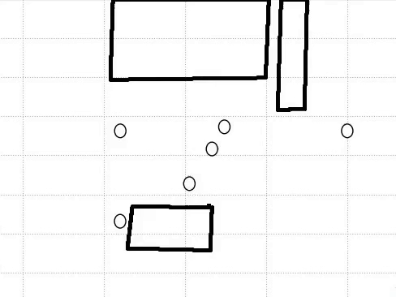

# Generate Datasets

The scripts in this folder allow you to generate synthetic datasets with the Social Force Model [[1]](#1) that either: 

* Focus on the social interactions between pedestrians and exclude human-space interactions
* Comprise human-space interactions in addition to human-human interactions

## Datasets focused on Social Interactions
 |  
:-------------------------:|:-------------------------:
Weak social interactions between pedestrians            |  Strong social interactions between pedestrians


As described in the [thesis](../Bachelor_Thesis_Philipp_Mondorf.pdf), we adapt the Social Force Model [[1]](#1) to generate datasets for which we can freely define the 
impact of social interactions on the motion of pedestrians. For this, we specify the **magnitude** and **range** of the *social forces* between pedestrians by modifying the parameters `V0` and `sigma`. 

### Generate Dataset

To generate datasets that exclusively focus on the interactions between pedestrians, run the script `main/GenPedPedScene.py`. A detailed explanation of the possible arguments can be found [here](./ARGUMENTS_PEDPED.md). For example to generate a dataset on which you can experiment with your trajectory prediction models, run the script like this:

```
python main/GenPedPedScene.py --V0 2 --sigma 1.303 --scenario square
```

The datasets generated are saved in the `./Experiments/datasets` folder. Make sure to specify the values of `--V0` and `--sigma` of the repulsive potential between pedestrians for which you want to generate the dataset.


### Generate training, validation and test sets

To generate a training, validation and test set on which you can train, validate and test your models, you just need to set the `--run_list` argument to `True`. This will also allow you to specify a list of values for `V0` and `sigma` for which these sets will be created. The list of values for `V0` and `sigma` need to be specified in the variables `V0_list` and `sigma_list` of the script `main/GenPedPedScene.py`. Once these values are defined, you can for example run the script like this:

```
python main/GenPedPedScene.py --run_list True --scenario square
```

### Create an Animation of Generated Data

To create an animation of the generated dataset, similar to the animations you can find above, run the script as follows:

```
python main/GenPedPedScene.py --V0 2 --sigma 1.303 --scenario square --show_animation True --show_potential True
```

Note that if the argument `--show_potential` is set to `True`, the *repulsive potential* between the pedestrians in a scene will be visualized in the animation. This requires comparable high computational costs.
The animations can be found under <code>docs/videos/PedPedScene/*datasetname*</code>. 

## Datasets comprising Human-Space Interactions

 | 
:-------------------------:|:-------------------------:
Snippet from real-world ZARA1 scenario [[2]](#2)          |  Snippet from simulated ZARA1 scenario

It is also possible to generate datasets that take the interactions between pedestrians and surrounding obstacles into account. As described in detail in chapter 4.2.2 of the [thesis](../Bachelor_Thesis_Philipp_Mondorf.pdf), it is possible to read in a segmented image of a real-world scenario like [this](docs/real_scene_images/zara1-op.jpg) in order to obtain the boundaries of obstacles for the dataset that you want to generate. 

### Generate Dataset 

To generate datasets that take human-space interactions into account, run the script `main/GenPedSpaceScene.py`.  A detailed explanation of the possible arguments can be found [here](./ARGUMENTS_PEDSPACE.md). 
For example to generate a dataset on which you can experiment with your trajectory prediction models, run the script like this:

```
python main/GenPedSpaceScene.py --V0 2 --sigma 0.8686 --U0 3 --r 0.4343 --scenario zara1
```

The datasets generated are saved in the `./Experiments/datasets` folder. Make sure to specify the values `--V0` and `--sigma` of the repulsive potential between pedestrians **and** the values `--U0` and `--r` of the repulsive potential between pedestrians and obstacles.

### Generate training, validation and test sets

Similar to the generation of datasets that exclusively focus on social interactions, set the `--run_list` argument to `True` and specify the values of `V0` and `sigma` in the variables `V0_list` and `sigma_list` of the script `main/GenPedSpaceScene.py`. Once these values are defined, you can for example run the script like this:

```
python main/GenPedSpaceScene.py --run_list True --U0 3 --r 0.4343 --scenario zara1
```

### Create an Animation of Generated Data

To create an animation of the generated datasets run the script as follows:

```
python main/GenPedSpaceScene.py --V0 2 --sigma 0.8686 --U0 3 --r 0.4343 --scenario zara1 --show_animation True
```

The animations can be found under <code>docs/videos/PedSpaceScene/*datasetname*</code>. 


## References
<a id="1">[1]</a>  D. Helbing and P. Molnár. “Social Force Model for Pedestrian Dynamics”. In: *Physical Review* 51.5 (1995).

<a id="2">[2]</a> A. Lerner, Y. Chrysanthou and D. Lischinski: „Crowds by Example“. In: *Comput. Graph. Forum* 26 (2007).