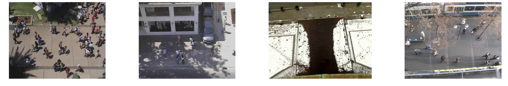
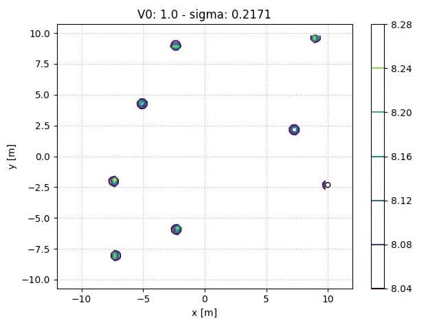
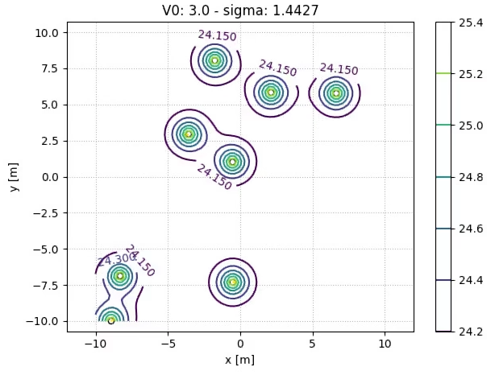

# Modeling Social Interactions for Pedestrian Trajectory Prediction

This is the code for the bachelor's thesis: 

P. Mondorf: [Modeling Social Interactions for Pedestrian Trajectory Prediction on Real and Synthetic Datasets](Bachelor_Thesis_Philipp_Mondorf.pdf), B.S. Thesis, Department of Informatics, Technical University of Munich, 2020. 

Humans moving in crowded spaces, such as sidewalks or shopping malls, socially interact with people in their vicinity. The ability to model these interactions is crucial to reliably predict human motion behavior.

In this thesis, we present a way to conveniently evaluate the ability of a trajectory prediction model to predict social interactions between pedestrians. We overcome the
limitations of real datasets by generating synthetic datasets for which we can define the
impact of social interactions on the motion of pedestrians. These hand-tailored datasets
exclude interactions between pedestrians and obstacles and focus on the interactions between
individuals. Furthermore, we introduce evaluation metrics that go beyond the commonly used average and final displacement error and focus on the interactions between pedestrians.

Below we show trajectories of pedestrians that socially interact with each other. We further compare the predictions of the Vanilla LSTM model (left) and the Social LSTM model (right). While the Vanilla LSTM model mainly predicts linear trajectories and ignores the interactions between neighboring pedestrians, we can see that the Social LSTM model predicts social interactions. These observations align with the quantitive evaluation of additional [experiments](Experiments) that were conducted on the two trajectory prediction models.

<br />

 |  
:-------------------------:|:-------------------------:
Predicted trajectories of the Vanilla LSTM Model | Predicted Trajectories of the Social LSTM Model [[1]](#1)

<br />

If you find this code useful for your research, please cite it as: 

```
@mastersthesis{MondorfSocInt2020,
    author = {Philipp Mondorf},
    title = {Modeling Social Interactions for Pedestrian Trajectory Prediction on Real and Synthetic Datasets}, 
    school = {Technical University of Munich},
    year = {2020}, 
    type = {B.Sc. Thesis}
}
```

## Setup
All code was developed and tested on Ubuntu 18.04 with Python 3.6.2 and PyTorch 1.2.0. 

To run the code, we recommend to setup a virtual environment: 

```bash
python3 -m venv env                     # Create virtual environment
source env/bin/activate                 # Activate virtual environment
pip install -r requirements.txt         # Install dependencies
# Work for a while
deactivate                              # Deactivate virtual environment
```

## Datasets 
You can conduct experiments on datasets of real-world human motion behavior and on synthetic datasets that simulate human motion behavior using the Social Force Model [[2]](#2). 

### Real Datasets

There exists a variety of publicly available datasets of real-world human trajectories that can be used for pedestrian trajectory predictions. In this thesis, we evaluate our models on two particular datasets: UCY [[3]](#3) and ETH [[4]](#4). You can find these datasets in the folder [Experiments/datasets](Experiments/datasets).




### Synthetic Datasets
Instructions for generating hand-tailored datasets that focus on the interactions between pedestrians can be found under [Generate_Datasets](Generate_Datasets).

 |  
:-------------------------:|:-------------------------:

## Experiments
Instructions for training and evaluating different trajectory prediction models on real and synthetic datasets can be found under [Experiments](Experiments).

## References
<a id="1">[1]</a>  A. Alahi, K. Goel, V. Ramanathan, A. Robicquet, L. Fei-Fei, and S. Savarese: “Social LSTM: Human Trajectory Prediction in Crowded Space”. In: *CVPR* (2016), pp. 961–971.

<a id="2">[2]</a>  D. Helbing and P. Molnár: “Social Force Model for Pedestrian Dynamics”. In: *Physical Review* 51.5 (1995).

<a id="3">[3]</a> A. Lerner, Y. Chrysanthou, and D. Lischinski: “Crowds by Example”. In: *Comput. Graph. Forum* 26 (Sept. 2007), pp. 655–664.

<a id="4">[4]</a> S. Pellegrini, A. Ess, K. Schindler, and L. van Gool: “You’ll never walk alone: Modeling social behavior for multi-target tracking”. In: *2009 IEEE 12th International Conference on Computer Vision*. 2009, pp. 261–268.